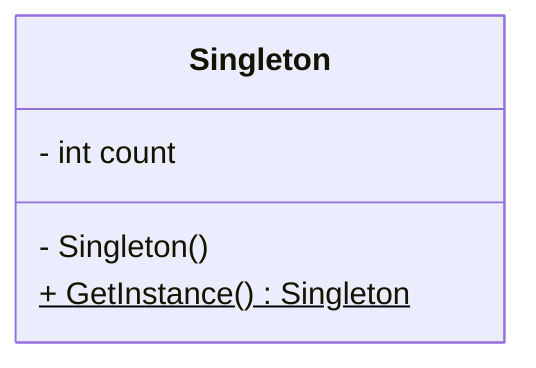
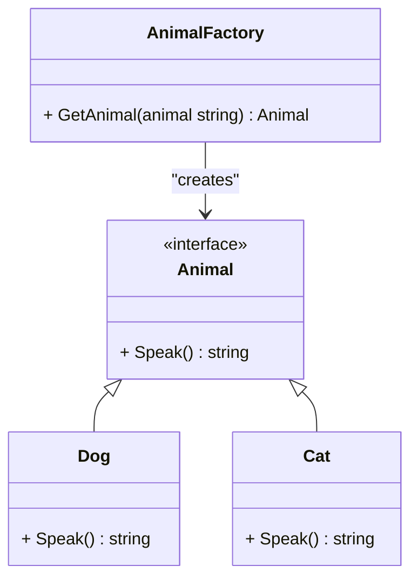
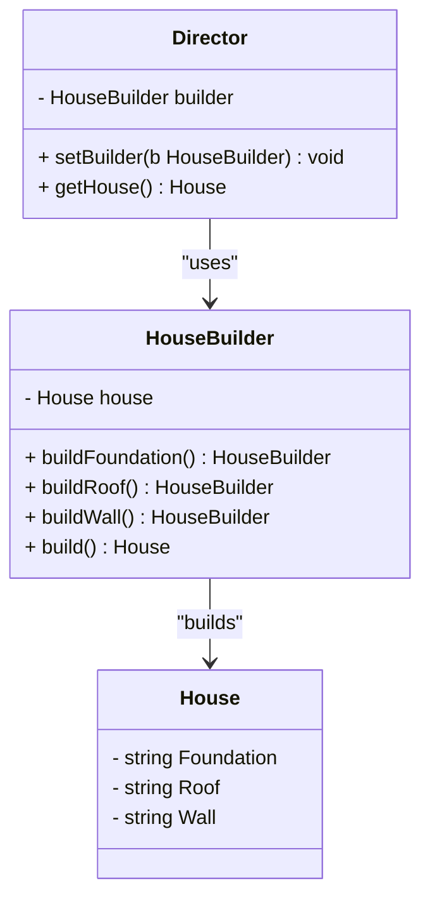

# design-patterns-golang
GOF design pattern in GO

## Creational Patterns:
- Singleton: Ensures a class has only one instance.

- Factory: Hides the instantiation logic.

- Builder: Constructs complex objects step by step.

## Structural Patterns:
- Adapter: Bridges incompatibility between interfaces.
- Decorator: Adds responsibilities to objects dynamically.
- Composite: Treats individual objects and compositions uniformly.

## Behavioral Patterns:
- Strategy: Encapsulates algorithms within a family.
- Observer: Notifies dependents of state changes.
- Command: Encapsulates method invocation.

## Concurrency Patterns (specific to Go):
- Pipeline: Passes data through stages of transformations.
- Worker Pools: Distributes tasks among workers.
- Channel Oriented Patterns: Communication between goroutines.
- Context Pattern: Useful for controlling goroutine lifecycles, canceling operations, and managing deadlines.

